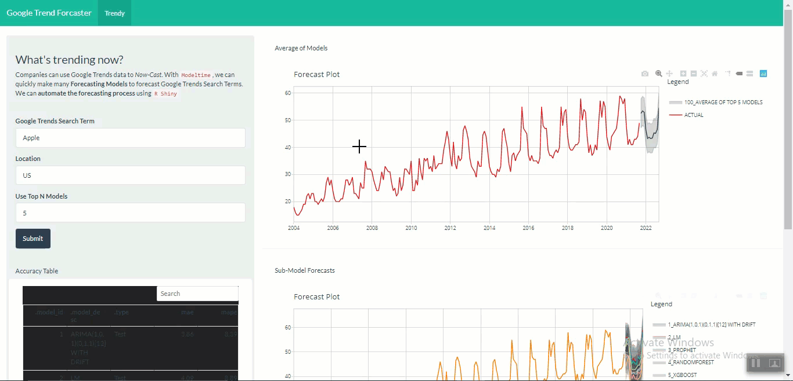

# Shiny Repo

Kumpulan aplikasi web yang dibuat dengan menggunakan framework shiny.

## 1. [Stock Analyzer](https://rosidi-second.shinyapps.io/idx_analyzer/)

Aplikasi yang digunakan untuk menganalisis trend saham pada periode tertentu dengan menggunakan double moving average smoothing.

**Tingkat Kesulitan**: Tinggi

**Skill**:

* desain ui menggunakan Boostrap 3
* desain login page
* desain shiny modules untuk pembuatan multiple cards
* desain persistent database untuk menyimpan sesi user

**R Packages**:

* `tidyquant`
* `shiny`
* `tidyverse`
* `shinyauthr`
* `mongolite`

## 2. [Customer Analyzer](https://rosidi-second.shinyapps.io/customer_analytics/)

Aplikasi untuk menganalisis profil resiko konsumen telefon seluler dan memberikan rekomendasi berdasarkan resiko masing-masing konsumen. Analisis juga disertai visualisasi kontribusi masing-masing variabel terhadap tingkat resiko.

**Tingkat Kesulitan**: Tinggi

**Skill**:

* desain dashboard menggunakan bootstrap 4
* explainable machine learning
* kustomisasi rekomendasi berdasarkan tingkat resiko customer

**R Packages**

* `shinydashboardplus`
* `DALEX`
* `tidymodels`
* `plotly`
* `shinyWidgets`
* `tidyverse`

## 3. [Zomato App](https://moh-rosidi.shinyapps.io/zomato_apps/)

Aplikasi yang digunakan untuk menganalisis biaya rata-rata makanan disebuah restoran dengan menganalisis faktor lokasi dan informasi umum terkait restorannya.

**Tingkat Kesulitan**: Tinggi

**Skill**:

* desain UI menggunakan bootstrap 3
* explainable machine learning
* desain peta menggunakan leaflet
* desain element yang saling berbagi data seperti tableu

**R Packages**

* `shiny`
* `shinyWidgets`
* `fresh`
* `leaflet`
* `DT`
* `plotly`
* `crosstalk`
* `tidymodels`
* `tidyverse`

## 4. [Google Trend Forecaster](https://moh-rosidi.shinyapps.io/google_trend_app/)

Aplikasi untuk melakukan forecast terhadap sebuah hasil pencarian trend kata kunci menggunakan metode average ensemble learning.

**Tingkat Kesulitan**: Sedang

**Skill**:

* desain UI menggunakan bootstrap 3
* forecasting menggunakan teknik ensemble

**R Packages**

* `shiny`
* `shinyWidgets`
* `DT`
* `plotly`
* `modeltime`
* `modeltime.ensemble`
* `tidyverse`
* `tidymodels`
* `gtendsR`

## 5. [Google Analytics Forecast App](https://moh-rosidi.shinyapps.io/03_ga_prophet_forecast_app/)

Aplikasi untuk menganalisis dan melakukan forecast tingkat kunjungan halaman webiste menggunakan model Prophet.

**Tingkat Kesulitan**: Mudah

**Skill**:

* desain UI menggunakan bootstrap 3
* forecasting menggunakan model prophet

**R Packages**

* `shiny`
* `flexdashboard`
* `DT`
* `plotly`
* `modeltime`
* `tidyverse`
* `tidymodels`
* `googleAnalyticsR`

## 6. E-Commerce App

Aplikasi yang digunakan untuk melakukan segmentasi dan memberikan rekomendasi penawaran produk berdasarkan profil belanja masing-masing konsumen.

**Tingkat Kesulitan**: Sedang

**Skill**:

* desain elemen UI menggunakan Bootsrap 3
* visualisasi karakteristik klaster menggunakan radar chart
* text mining untuk mengekstrak informasi pembelian
* reduksi dimensi menggunakan metode t-SNE
* segmentasi produk dan konsumen menggunakan K-Means
* prediksi klaster konsumen menggunakan regresi logistik

**R Packages**:

* `shiny`
* `shinythemes`
* `tidytext`
* `ggiraph`
* `tidyverse`
* `tidymodels`
* `DT`
* `kableExtra`

## 7. Human Resource App

Aplikasi yang digunakan untuk menganalisis profil karyawan.

**Tingkat Kesulitan**: Sedang

**Skill**:

* desain elemen UI menggunakan Bootsrap 3
* reduksi dimensi menggunakan metode t-SNE
* segmentasi karywan DBScan

**R Packages**:

* `shiny`
* `shinythemes`
* `tidyquant`
* `tidyverse`
* `tidymodels`
* `DT`
* `plotly`
